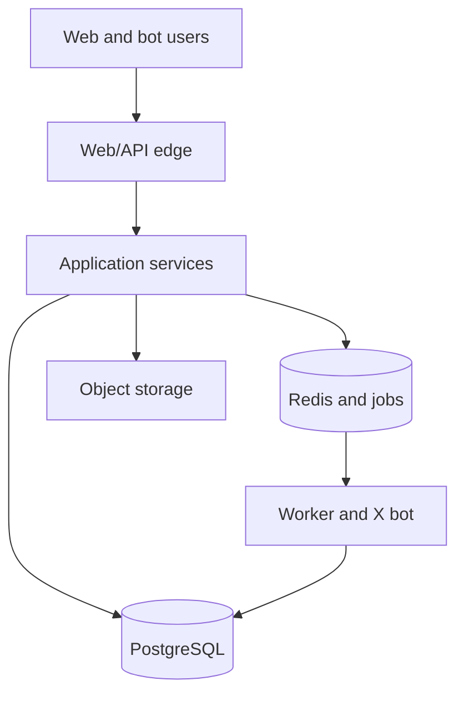

# eLafda: End-to-End Product and Technical Specification

**Domain:** `elafda.org`
**Main X account:** `@eLafdaOrg`
**Bot X account:** `@eLafdaBot`
**Status:** Implementation specification, v1.0
**Date:** 15 August 2026

## 1. Executive summary

eLafda is an open-source, community-governed platform for documenting and discussing Indian internet controversies. It combines:

- Reddit-style posts, comments, voting, sharing, saving and following
- Wikipedia-style, source-backed case summaries and timelines
- GitHub-style change history, review and contributor attribution
- An X bot that can be tagged to nominate threads, submit updates and retrieve case links

The key product rule is that **discussion and historical record are separate layers**. Users can post opinions freely within policy, but an allegation or event enters a canonical case timeline only after its sources and wording pass review.

### One-line pitch

> The open-source home of internet lafda.

### Product promise

> Follow the conversation, inspect the evidence and preserve what actually happened.

## 2. Goals and non-goals

### Goals

1. Make ongoing internet controversies easy to follow.
2. Preserve source-backed timelines after posts are edited or deleted.
3. Let anyone contribute through the website or GitHub.
4. Support entertaining community discussion without presenting popularity as truth.
5. Make moderation decisions and case revisions traceable.
6. Provide a self-hostable open-source codebase with documented deployment.
7. Minimize legal, safety and privacy risks through product design.

### Non-goals for v1

- Becoming a general-purpose social network
- Automatically declaring allegations true
- Hosting leaks, doxxing, intimate media or illegally obtained private material
- Republishing complete copyrighted articles or videos
- End-to-end encrypted private messaging
- Native mobile applications
- Algorithmically generating accusations or identifying private individuals

## 3. Users and roles

| Role                | Capabilities                                                          |
| ------------------- | --------------------------------------------------------------------- |
| Visitor             | Browse, search, share and view public profiles                        |
| Member              | Post, comment, vote, save, follow, report and submit cases or updates |
| Trusted contributor | Review sources, propose canonical wording and label duplicates        |
| Moderator           | Remove content, lock discussions, issue sanctions and process appeals |
| Archivist           | Approve canonical timeline updates and case revisions                 |
| Administrator       | Manage roles, policies, system settings and emergency controls        |
| Bot service         | Ingest X mentions and publish deterministic responses                 |

Roles use additive permissions. Administrative actions require strong authentication and are recorded in an immutable audit log.

## 4. Core domain language

- **Case:** The durable page representing one controversy.
- **Post:** A community submission inside a case or the general feed.
- **Comment:** A nested response beneath a post or update.
- **Update proposal:** A candidate event for the canonical timeline.
- **Timeline event:** A reviewed, source-backed event in the canonical record.
- **Evidence:** A URL, permitted screenshot, document or media reference supporting a claim.
- **Claim:** A discrete factual assertion connected to evidence.
- **Verdict:** A community poll, never an editorial statement of fact.
- **Note:** Community or moderator context attached to a post, source or claim.
- **Revision:** A versioned change to canonical content.

## 5. Product information architecture

### Public routes

| Route                               | Purpose                           |
| ----------------------------------- | --------------------------------- |
| `/`                                 | Personalized or public home feed  |
| `/cases`                            | Browse all cases                  |
| `/case/[slug]`                      | Case overview and activity        |
| `/case/[slug]/timeline`             | Canonical chronological record    |
| `/case/[slug]/evidence`             | Evidence index and source status  |
| `/case/[slug]/revisions`            | Public change history             |
| `/post/[id]`                        | Shareable post and comments       |
| `/u/[username]`                     | Public contributor profile        |
| `/search`                           | Cases, people, tags and posts     |
| `/submit`                           | New case, post or update workflow |
| `/about`, `/rules`, `/transparency` | Governance and safety information |

### Authenticated routes

- `/notifications`
- `/saved`
- `/following`
- `/settings`
- `/appeals`
- `/mod/*` for authorized reviewers

## 6. Case page specification

### Header

- Case title and stable case ID, for example `ELF-2026-0021`
- Neutral one-sentence summary
- Status: developing, active, dormant, resolved or archived
- Risk label: disputed claims, legal proceedings, graphic media or identity sensitivity
- Participants and organizations
- Categories and tags
- Last verified update timestamp
- Follow, share and submit update actions

### Tabs

1. **Overview:** Summary, key participants, latest verified update and active poll.
2. **Discussion:** Posts sorted by hot, new, top or controversial.
3. **Timeline:** Canonical events with sources and revision history.
4. **Evidence:** Sources grouped by type and reliability state.
5. **Revisions:** Public diff and approval trail.

### Case lifecycle

`draft -> under_review -> published -> developing/resolved/dormant -> archived`

A case may be temporarily `restricted` or `locked` without changing its historical status.

## 7. Community features

### Posts

Post types:

- Discussion
- Analysis
- Question
- Meme or satire
- Firsthand account
- Source or evidence
- Update proposal

Each post supports Markdown, link previews, content warnings, case association, tags and optional media. The UI must visibly distinguish opinion, satire, firsthand claims and verified timeline content.

### Comments

- Nested threads with a maximum rendered depth of six, then continue-thread links
- Upvote and downvote
- Sort by best, top, new, old and controversial
- Edit history after a short grace period
- Collapse, mute, report and permalink
- Moderator and archivist badges that cannot be self-assigned

### Votes

- One active vote per user per target
- Score is computed server-side
- Vote changes are allowed and idempotent
- Raw voter identities are never public
- Suspicious voting is excluded from ranking pending review
- Votes affect discovery, not canonical truth or evidence status

### Following and notifications

Users can follow cases, people or tags. Notification types include:

- New canonical update
- Reply or mention
- Case status change
- Update proposal decision
- Moderation action or appeal result

Email digests are opt-in. Push notifications are deferred until after v1.

### Sharing

- Canonical URLs with Open Graph cards
- Share a case, timeline event, post or comment
- Copy link and native Web Share API
- X share intent with concise, non-accusatory default copy
- Embed card endpoint for approved third-party use

## 8. Case and update contribution workflows

### Web submission

1. User selects new case, post or update.
2. Duplicate search runs against names, URLs and semantic similarity.
3. Form collects neutral title, summary, participants, date and sources.
4. User classifies each statement as fact, allegation, opinion or satire.
5. Automated checks flag private data, slurs, unsupported allegations and duplicate media.
6. Submission enters the appropriate queue.
7. User receives a public or private review status and can revise.

### Update review

`submitted -> needs_sources -> community_review -> archivist_review -> accepted/disputed/rejected`

- Accepted updates enter the timeline.
- Disputed updates may appear with prominent contrary evidence and wording.
- Rejected updates remain visible to the submitter with a reason and appeal option.

### GitHub contribution

Case records may be exported to and proposed from YAML files validated against a versioned JSON Schema. Pull requests trigger schema, source, duplicate and link checks. Approved content is imported through a signed administrative workflow. The database remains the production source of truth; Git mirrors canonical content for transparency and portability.

## 9. X bot specification

### Accounts

- `@eLafdaOrg`: editorial highlights, product announcements and community recaps
- `@eLafdaBot`: tagged utility interactions and deterministic case notifications

### Supported intents

| Mention text                | Bot behavior                                              |
| --------------------------- | --------------------------------------------------------- |
| `@eLafdaBot track this`     | Create a private nomination and return a review link      |
| `@eLafdaBot open a case`    | Same as track, with duplicate detection                   |
| `@eLafdaBot add update`     | Attach the tweet to an existing or selected case proposal |
| `@eLafdaBot find this`      | Return a likely matching case, or say none was found      |
| `@eLafdaBot archive thread` | Capture permitted metadata and referenced URLs for review |
| `@eLafdaBot help`           | Return supported commands                                 |

Natural-language classification can map variants to these intents, but every write action is constrained by deterministic validation.

### Bot ingestion flow

1. Receive or poll for an authenticated mention.
2. Verify tweet ID, author ID and parent/conversation metadata.
3. Deduplicate by platform and external event ID.
4. Reject protected, blocked, deleted or policy-prohibited content where detectable.
5. Classify intent and extract referenced case or thread.
6. Create a nomination, never a published allegation.
7. Generate a signed review link tied to the nominating user.
8. Reply once using an idempotency key.
9. Store an audit record and retry transient failures through the job queue.

### Example reply

> Filed for community review as nomination ELF-N-4821. Add context and sources: elafda.org/n/ELF-N-4821

### Bot safety requirements

- Never summarize unreviewed allegations as fact
- Never name a private individual extracted only from an image
- Never download arbitrary linked files
- Never reproduce deleted media automatically
- Rate-limit by user, conversation and case
- Maintain deny lists, emergency pause and per-case bot locks
- Obey platform rules and deletion signals

## 10. Moderation, safety and legal design

This section is a product requirement, not optional policy copy.

### Content states

- `visible`
- `soft_limited` for reduced distribution
- `source_required`
- `disputed`
- `locked`
- `removed`
- `legal_hold`

### Prohibited content

- Doxxing and private contact or location data
- Non-consensual intimate content
- Sexual content involving minors
- Credible threats or targeted harassment
- Instructions facilitating violence or illegal access
- Fabricated evidence and impersonation
- Private medical, financial or identity documents
- Copyright infringement beyond permitted quotation, linking or transformation

### Allegation handling

- Use attribution: “X alleged” rather than asserting guilt.
- Link to primary sources where lawful and safe.
- Mark court, police and regulator status precisely.
- Never infer guilt from an FIR, complaint, arrest or investigation.
- Show material responses and corrections with comparable prominence.
- Support a verified right-to-reply channel.

### Enforcement ladder

Warning, temporary posting limit, temporary suspension, permanent suspension and emergency platform ban. Severe violations can skip intermediate steps.

### Appeals and transparency

- Every moderation action has a reason code.
- Users can appeal once with additional context.
- A different moderator reviews appeals when practical.
- Publish aggregate transparency reports without exposing victims or reporters.
- Maintain an authenticated legal-request channel and preservation procedure.

Before public launch, Indian counsel should review intermediary obligations, grievance processes, defamation exposure, privacy, evidence preservation, takedowns and terms. This specification is not legal advice.

## 11. Ranking and discovery

### Feed ranking

A transparent initial ranking model:

```text
rank = confidence_weight
     * log10(max(abs(net_votes), 1))
     * freshness_decay
     * quality_multiplier
     * safety_multiplier
```

Signals:

- Net votes with Bayesian smoothing
- Unique commenters and followers
- Fresh canonical updates
- Source quality and completeness
- Author trust, capped to avoid oligarchy
- Reports and brigading risk

Chronological sorting must always be available. Political or sensitive cases should not use personalization based on inferred ideology.

### Search

Phase 1 uses PostgreSQL full-text search and trigram indexes across cases, aliases, participants, tags and posts. Add a dedicated search service only after relevance or scale requires it.

## 12. Reputation and anti-abuse

Reputation is earned from accepted updates, useful source reviews, upheld reports and constructive participation. It is reduced by reversed moderation decisions, spam and coordinated manipulation.

Reputation unlocks workflow privileges, not factual authority. Controls include:

- Account-age and reputation thresholds
- Per-action token-bucket rate limits
- X OAuth and account-risk checks
- Device and network signals stored only as privacy-preserving risk data
- Vote-ring and burst detection
- Link-domain risk scoring
- CAPTCHA only when risk increases
- Slow mode, case quarantine and read-only emergency mode

## 13. Technical architecture

### Recommended stack

| Layer                | Choice                                              | Reason                                                        |
| -------------------- | --------------------------------------------------- | ------------------------------------------------------------- |
| Web application      | Next.js with TypeScript                             | SSR, share previews and a large contributor ecosystem         |
| UI                   | Tailwind CSS plus accessible headless primitives    | Fast iteration without a proprietary component dependency     |
| API                  | Next.js route handlers with a typed service layer   | One codebase for v1, separable later                          |
| Database             | PostgreSQL                                          | Transactions, relational integrity and strong search baseline |
| ORM and migrations   | Drizzle ORM                                         | Explicit SQL-friendly schema and portable migrations          |
| Authentication       | Auth.js with the X provider                         | X-only member sign-in with self-hostable session logic        |
| Jobs and rate limits | Redis-compatible service plus worker                | Retries, delayed jobs and distributed limits                  |
| Object storage       | S3-compatible storage                               | Portable media abstraction                                    |
| Validation           | Zod plus JSON Schema exports                        | Shared runtime and contribution validation                    |
| Testing              | Vitest, Testing Library and Playwright              | Unit, component and end-to-end coverage                       |
| Observability        | OpenTelemetry plus pluggable error and log backends | Vendor-neutral instrumentation                                |

### Logical architecture



### Service boundaries

- Identity and profiles
- Cases and canonical revisions
- Posts, comments and votes
- Evidence and media
- Moderation and appeals
- Notifications
- Search and ranking
- External platform ingestion
- Audit and transparency

Keep these as modules in a modular monolith for v1. Extract services only when operational boundaries become real.

## 14. Data model

All primary keys use UUIDv7. Public IDs are separate, stable and non-sequential where enumeration creates risk.

### Principal tables

| Table                  | Important fields                                                      |
| ---------------------- | --------------------------------------------------------------------- |
| `users`                | id, username, display_name, status, reputation, created_at            |
| `accounts`             | user_id, provider fixed to x, provider_account_id, tokens_encrypted   |
| `roles` / `user_roles` | role, scope, granted_by, expires_at                                   |
| `cases`                | id, public_id, slug, title, summary, status, risk_level, published_at |
| `case_participants`    | case_id, entity_id, role, display_order                               |
| `entities`             | type, canonical_name, aliases, public_person_status                   |
| `case_revisions`       | case_id, version, document_json, diff, author_id, approval_id         |
| `timeline_events`      | case_id, occurred_at, precision, title, body, status, revision        |
| `claims`               | subject_type, subject_id, text, classification, verification_state    |
| `sources`              | canonical_url, domain, type, published_at, archive_state, hash        |
| `claim_sources`        | claim_id, source_id, support_type, reviewer_id                        |
| `posts`                | case_id, author_id, type, title, body, status, score, created_at      |
| `comments`             | post_id, parent_id, path, depth, author_id, body, status              |
| `votes`                | user_id, target_type, target_id, value, risk_state                    |
| `follows`              | user_id, target_type, target_id                                       |
| `notifications`        | user_id, type, payload, read_at                                       |
| `reports`              | reporter_id, target, reason, details, state, assignee_id              |
| `moderation_actions`   | target, action, reason, actor_id, expires_at                          |
| `appeals`              | action_id, appellant_id, text, state, reviewer_id                     |
| `bot_events`           | platform, external_id, intent, state, payload_redacted, reply_id      |
| `jobs`                 | type, payload, state, run_at, attempts, idempotency_key               |
| `audit_log`            | actor, action, object, before_hash, after_hash, created_at            |

### Constraints

- Unique vote on `(user_id, target_type, target_id)`
- Unique bot event on `(platform, external_id)`
- Unique case slug and public ID
- Timeline publication requires at least one qualifying source or explicit `disputed` status
- Soft deletion for user content, tombstones for public threads and append-only canonical revisions
- Source URLs are normalized before duplicate comparison

## 15. API specification

Expose REST-style JSON under `/api/v1`. Generate OpenAPI documentation from route schemas.

### Core endpoints

```text
GET    /cases
POST   /cases
GET    /cases/{caseId}
PATCH  /cases/{caseId}
POST   /cases/{caseId}/follow
POST   /cases/{caseId}/updates
GET    /cases/{caseId}/timeline
GET    /cases/{caseId}/revisions

POST   /posts
GET    /posts/{postId}
PATCH  /posts/{postId}
DELETE /posts/{postId}
POST   /posts/{postId}/comments

PUT    /votes/{targetType}/{targetId}
DELETE /votes/{targetType}/{targetId}

POST   /reports
POST   /moderation/actions
POST   /moderation/actions/{id}/appeals

POST   /integrations/x/events
POST   /integrations/x/reconcile
GET    /search
```

### API rules

- Cursor pagination only for feeds and comments
- Idempotency keys for submissions, votes, bot events and moderation actions
- Optimistic concurrency through revision numbers or ETags
- Consistent error envelope with machine-readable codes
- Authorization enforced inside service methods, not only route middleware
- Public write API deferred until abuse controls are proven

## 16. Repository and open-source structure

Create the GitHub organization `elafda` and begin with one repository:

```text
elafda/
├── apps/
│   ├── web/
│   └── worker/
├── packages/
│   ├── db/
│   ├── domain/
│   ├── ui/
│   ├── config/
│   └── case-schema/
├── cases/
├── docs/
├── infra/
├── scripts/
├── .github/
├── CONTRIBUTING.md
├── CONTENT_POLICY.md
├── SECURITY.md
├── GOVERNANCE.md
└── LICENSE
```

Use `pnpm` workspaces and Turborepo. The bot stays in the monorepo until independent deployment cadence or ownership justifies a split.

### Licences

- Code: GNU Affero General Public License v3.0 or later (`AGPL-3.0-or-later`)
- Original case text: choose a clearly stated open-content licence after legal review
- Third-party evidence: retain original ownership and licensing metadata, do not relicense it
- Contributor agreement: Developer Certificate of Origin initially, CLA only if future relicensing requires it

### Contribution gates

- Signed-off commits for canonical case changes
- Automated formatting, type, unit, schema, migration and security checks
- CODEOWNERS review for auth, moderation, legal-policy and infrastructure paths
- Preview deployment for every trusted pull request
- No secrets in forks or preview environments

## 17. Security and privacy

### Security baseline

- HTTP-only, secure, same-site session cookies
- OAuth PKCE and state validation
- CSRF protection for cookie-authenticated mutations
- Content Security Policy with nonces
- Strict input validation and output encoding
- Parameterized queries and least-privilege database roles
- Signed, short-lived upload URLs
- Media type verification, malware scanning and image metadata stripping
- Encryption in transit and managed encryption at rest
- Secret rotation and separate production credentials
- Dependency, static analysis and secret scanning in CI
- Admin hardware-key or passkey requirement

### Privacy

- Collect only necessary account and abuse-prevention data
- Publish retention periods by data category
- Separate moderation evidence from public content
- Allow account deletion while retaining lawful public-interest revisions through pseudonymized attribution where appropriate
- Never expose voter, reporter or private appeal identities
- Scrub sensitive fields from logs and bot payloads

### Backups and recovery

- Point-in-time database recovery where supported
- Daily logical export encrypted to a separate account or provider
- Object versioning or lifecycle-protected backup for evidence metadata
- Quarterly restore exercise
- Target RPO: 15 minutes for database, 24 hours for media
- Target RTO: 4 hours for core read-only service, 12 hours for full writes

## 18. Deployment architecture

### Recommended managed production deployment

| Component                 | Production target                                                     |
| ------------------------- | --------------------------------------------------------------------- |
| DNS and edge controls     | Cloudflare                                                            |
| vinext web and API        | Cloudflare Workers                                                    |
| PostgreSQL                | Neon pooled PostgreSQL                                                |
| Redis and queues          | Managed Redis-compatible provider                                     |
| Bot and background worker | Railway, Render, Fly.io or equivalent long-running container platform |
| Media                     | Private Cloudflare R2 bucket with signed delivery                     |
| Email                     | Transactional email provider through an adapter                       |
| Monitoring                | OpenTelemetry collector plus hosted errors, logs and uptime checks    |

Cloudflare Workers host the server-rendered web application and request-driven API workloads behind Cloudflare DNS. A separate continuously running worker remains preferred for queue consumption, bot retries and reconciliation. Neon pooled or HTTP connections should be used for edge concurrency. R2 is accessed through an S3-compatible adapter so self-hosters can substitute MinIO or S3.

### Environments

| Environment | Trigger                                 | Data                                          |
| ----------- | --------------------------------------- | --------------------------------------------- |
| Local       | Developer command                       | Seeded local services                         |
| Preview     | Pull request                            | Isolated or sanitized preview database branch |
| Staging     | Merge to `develop` or release candidate | Synthetic plus approved test cases            |
| Production  | Signed release promoted from staging    | Live data                                     |

Never copy production user content into preview environments.

### Domain setup

- `elafda.org`: production web application
- `www.elafda.org`: redirect to apex
- `api.elafda.org`: reserve for future external API separation
- `status.elafda.org`: independently hosted status page
- `docs.elafda.org`: contributor and API documentation
- `media.elafda.org`: controlled media delivery, not a public storage bucket

Enable DNSSEC, HSTS after validation, CAA records, SPF, DKIM and DMARC. Protect the registrar and DNS accounts with hardware-backed MFA.

### Infrastructure as code

- Terraform under `/infra` for DNS, storage, queues where supported and monitoring resources
- Vendor project configuration committed when safe
- Secrets stored only in deployment secret managers
- Production changes through reviewed pull requests
- Manual emergency changes documented and reconciled back into code

### Deployment pipeline

1. Open pull request.
2. Run format, lint, types, unit tests, schema validation and migration checks.
3. Run dependency, secret and static security scans.
4. Build immutable artifacts and preview deployment.
5. Run Playwright smoke tests and accessibility checks.
6. Require code-owner approval for sensitive paths.
7. Merge and deploy staging.
8. Apply backward-compatible migrations.
9. Run staging smoke and bot sandbox tests.
10. Promote the same release to production.
11. Run synthetic checks and monitor error budget.
12. Roll back application first; use forward-fix migrations for database changes.

### Migration discipline

Use expand-and-contract database changes:

1. Add backward-compatible fields or tables.
2. Deploy code that supports both representations.
3. Backfill asynchronously.
4. Switch reads and writes.
5. Remove obsolete structures in a later release.

### Self-hosting profile

Provide Docker Compose for web, worker, PostgreSQL, Redis-compatible queue, MinIO and local SMTP capture. Production self-hosters can replace each adapter independently. Include health endpoints, environment templates and one-command database migration.

## 19. Configuration and secrets

Minimum production configuration groups:

```text
APP_URL
DATABASE_URL
REDIS_URL
AUTH_SECRET
AUTH_X_CLIENT_ID / AUTH_X_CLIENT_SECRET
S3_ENDPOINT / S3_BUCKET / S3_ACCESS_KEY_ID / S3_SECRET_ACCESS_KEY
X_BOT_CLIENT_ID / X_BOT_CLIENT_SECRET / X_BOT_ACCESS_TOKEN
EMAIL_PROVIDER_*
OTEL_EXPORTER_OTLP_ENDPOINT
MODERATION_ENCRYPTION_KEY
CRON_SECRET
```

Validate configuration at process start. Never expose server-only variables through client-prefixed names.

## 20. Observability and operations

### Service-level indicators

- Availability and p95 latency for homepage, case page and mutations
- Queue age and job failure rate
- Bot mention-to-reply latency
- Database saturation and slow queries
- Upload scan time and failure rate
- Moderation queue age
- Notification delivery success

### Initial objectives

- 99.9% monthly availability for public case reads
- p95 cached case read under 800 ms from India
- p95 ordinary write under 1.5 seconds
- 95% of bot mentions acknowledged within five minutes when X is available
- 90% of high-risk reports reviewed within four hours during staffed periods

### Runbooks

Maintain runbooks for database outage, compromised administrator, leaked secret, bot reply storm, brigading, illegal-content report, takedown request, storage exposure and deployment rollback.

## 21. Analytics

Measure product health without maximizing outrage:

- Case follows and return visits after verified updates
- Percentage of published updates with primary sources
- Median review time and correction time
- Accepted contribution rate
- Constructive-comment and upheld-report rates
- Search success and duplicate prevention
- Bot nominations converted into reviewed cases

Do not optimize for raw watch time, angry reactions or repost velocity.

## 22. Accessibility and localization

- Target WCAG 2.2 AA
- Full keyboard navigation and visible focus
- Semantic headings and screen-reader labels
- Reduced-motion support
- Alt text and transcripts for material media
- English first, with architecture ready for Hindi and Indian-language translations
- Preserve original-language quotes alongside translations and label machine translations

## 23. Testing strategy

### Unit tests

Ranking, permissions, state transitions, URL normalization, voting, rate limits and bot intent mapping.

### Integration tests

Database constraints, migrations, X OAuth callbacks, provider allowlisting, queue retries, object-storage signing and moderation audit entries.

### End-to-end tests

- Register and create a post
- Submit and approve a timeline update
- Comment, vote, follow and receive a notification
- Report, moderate and appeal content
- Tag bot fixture, deduplicate event and publish one reply
- Restore read-only service during dependency failure

### Adversarial tests

Stored XSS, SSRF through evidence URLs, malicious uploads, IDOR, vote manipulation, Unicode impersonation, prompt injection in bot-linked content and moderator privilege escalation.

## 24. MVP scope and delivery phases

### Phase 0: Foundation, 1 week

- Secure domain, X handles and GitHub organization
- Publish README, roadmap, licence, code of conduct and content policy draft
- Set up monorepo, CI, environments and database migrations

### Phase 1: Readable archive, 2 to 3 weeks

- Public case directory, case pages, timeline and search
- Admin-authored canonical cases and revisions
- Responsive UI, SEO, Open Graph cards and analytics

### Phase 2: Community, 3 to 4 weeks

- X-only authentication and profiles
- Posts, nested comments, votes, follows, saves and notifications
- Reporting, basic moderation and rate limiting

### Phase 3: Open contributions, 2 to 3 weeks

- New-case and timeline-update proposals
- Reviewer queues, source status, diffs and appeals
- YAML export/import and GitHub contribution workflow

### Phase 4: X bot, 2 weeks

- Mention ingestion or polling adapter
- Track, update, find and help intents
- Review links, idempotent replies, retries and emergency pause

### Phase 5: Hardening and public launch, 2 weeks

- Security review, load tests, restore test and policy review
- Seed 20 to 30 high-quality cases
- Recruit initial archivists and publish governance rules
- Launch transparency dashboard and status page

## 25. Launch acceptance criteria

- No unreviewed submission can enter the canonical timeline
- Every canonical factual claim can reference its supporting source state
- Votes cannot alter verification status
- Bot writes are idempotent and can be paused instantly
- Moderator actions and canonical revisions are auditable
- Backups have been restored successfully in a test environment
- Accessibility smoke tests pass on critical journeys
- Legal, content, privacy and grievance policies are published
- Production secrets are isolated and administrator MFA is enforced
- At least three non-founder contributors can successfully run the project locally

## 26. Decisions to make before coding

1. Whether public launch covers all Indian internet culture or begins with Tech Twitter.
2. Whether users may upload screenshots or only link to original and archived sources initially.
3. The jurisdiction and identity of the platform operator.
4. The exact open-content licence for original case records.
5. Whether downvotes are public as a score or used only for ranking.
6. Who constitutes the initial archivist and appeals group.
7. Which X API access path is available and permitted for mention ingestion.

## 27. Recommended initial decisions

- Launch with **Indian Tech Twitter** to concentrate community and moderation capacity.
- Allow link evidence immediately; enable image uploads only after scanning and takedown operations are ready.
- Display net scores while hiding raw voter identities.
- Use a founder-appointed interim moderation group with decisions and tenure published.
- Keep canonical data in PostgreSQL and mirror accepted case records to GitHub daily.
- Run the web tier on Cloudflare Workers behind Cloudflare DNS, PostgreSQL on Neon, media on private R2 and the background worker on a container host.
- Treat the X bot as a nomination interface, never an autonomous publisher.
- Use X as the sole member sign-in provider; keep member OAuth credentials separate from bot credentials.

## 28. Definition of success for the first 90 days

- 30 well-sourced published cases
- 100 accepted community timeline contributions
- 1,000 registered users with healthy repeat participation
- Median canonical update review under 12 hours
- Fewer than 2% of published canonical updates requiring material correction
- A functioning contributor community with at least five regular non-founder contributors
- A bot workflow that converts tags into reviewable nominations without creating public factual errors

## 29. Reference deployment documentation

- Cloudflare Workers framework deployment: <https://developers.cloudflare.com/workers/framework-guides/>
- Cloudflare Workers custom domains: <https://developers.cloudflare.com/workers/configuration/routing/custom-domains/>
- Neon connection pooling: <https://neon.com/docs/connect/connection-pooling>
- Cloudflare R2 S3 compatibility: <https://developers.cloudflare.com/r2/api/s3/api/>
